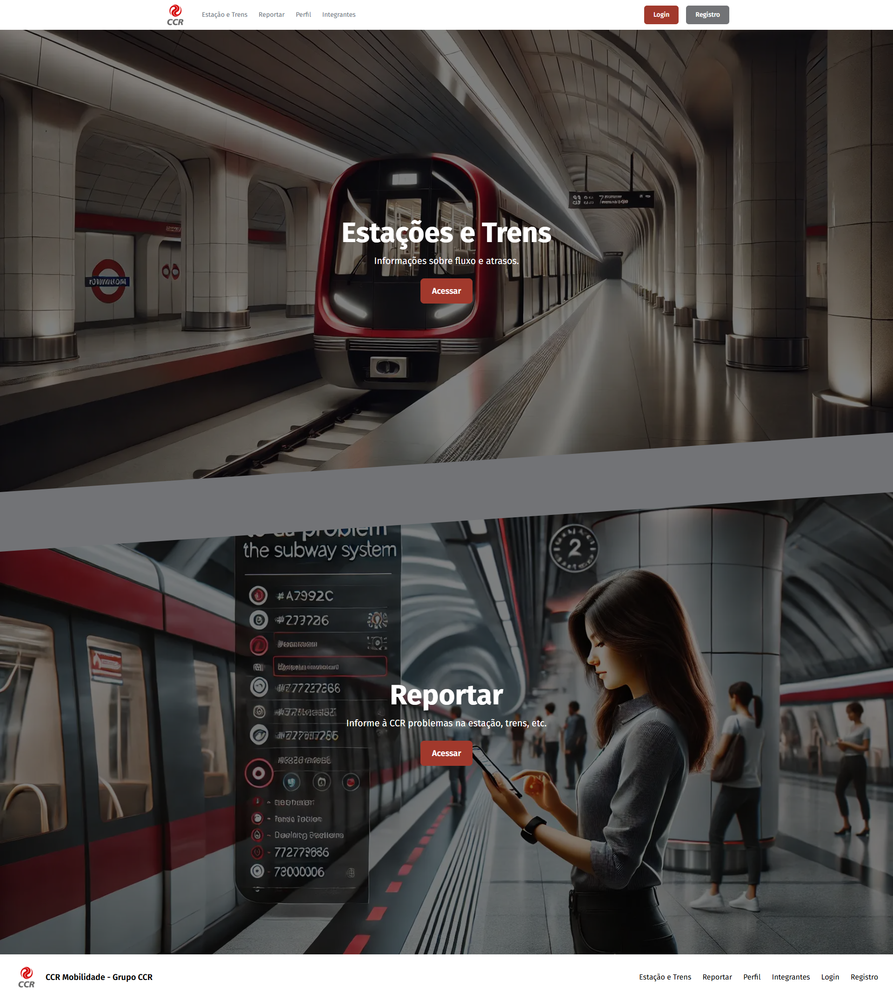
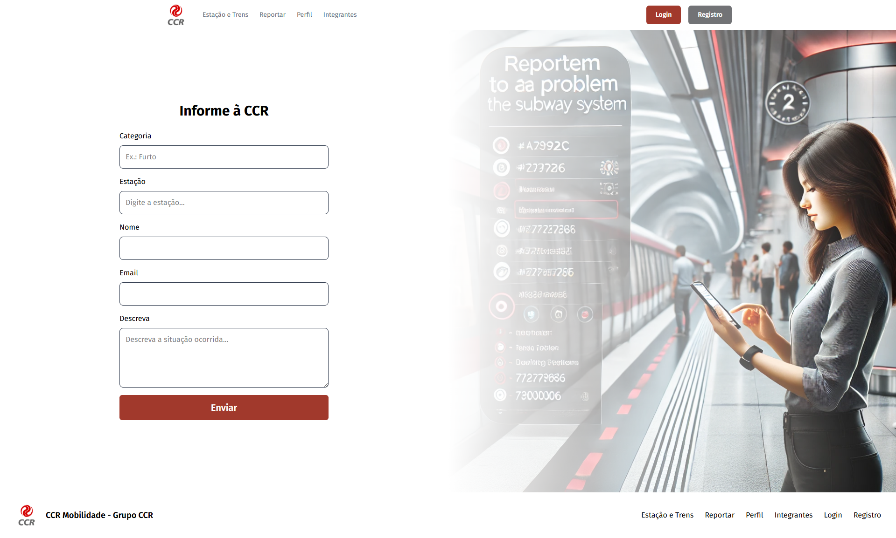
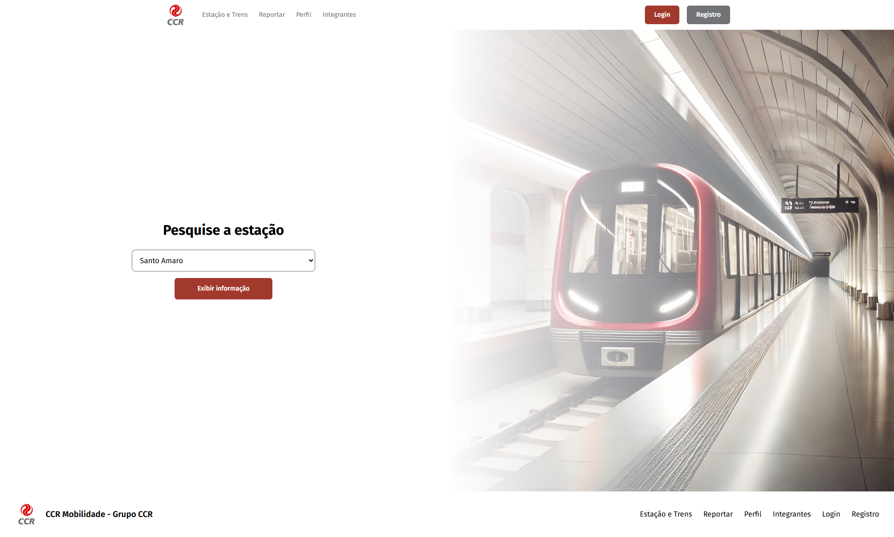
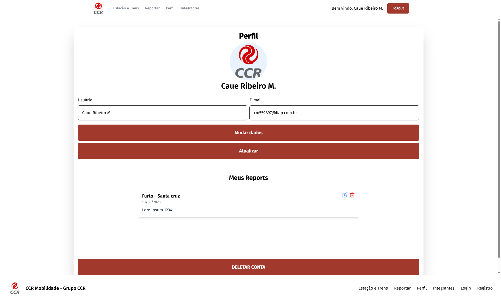

# 📌 Projeto: Sistema de Estações e Trens

Este repositório contém o desenvolvimento do sistema de estações e trens, um projeto focado em fornecer informações em tempo real sobre estações, trens e ocorrências relatadas pelos usuários. Além disso, permite que os usuários criem contas para personalizar sua experiência.

## 🚀 Roadmap

1. **Planejamento** ✅
2. **Definição das funcionalidades** ✅
3. **Criação das telas e design** ✅
4. **Desenvolvimento do front-end** ✅
5. **Integração com back-end e banco de dados** ✅

## 📂 Estrutura do Projeto

O sistema é composto por diversas páginas, cada uma com funcionalidades específicas:

-   **Página Inicial** 🏠: Página principal do sistema, permitindo acesso às principais funcionalidades: Estação & Trens e o Sistema de Report para usuários.

-   **Página de Report** ⚠️: Permite que usuários registrem ocorrências na estação, como furtos, vagões sujos ou pessoas importunas.
-   **Página Estação & Trens** 🚆: Exibe informações sobre estações e seus trens sendo elas: fluxo de passageiros e status de atrasos.
-   **Página Perfil** 👤: Área do usuário onde ele pode consultar e editar seus dados.
-   **Página Registro** 📝: Permite a criação de uma nova conta de usuário.
-   **Página Login** 🔑: Para autenticação e acesso à conta do usuário.
-   **Página Integrantes** 👥: Apresenta os membros responsáveis pelo desenvolvimento do projeto.

## 🔗 Links Importantes

-   [Projeto na Vercel](https://challenge-ccr.vercel.app/)
-   [Repositório API em Java Quarkus](https://github.com/challengefiap-ccr/API-QUARKUS-CCR)
-   [Repositório API em Python Flask](https://github.com/challengefiap-ccr/API_PYTHON_CCR)

## 🖼️ Prints de Telas (Principais Funcionalidades)

Abaixo estão algumas capturas de tela do sistema em funcionamento:

### 📝 Página Registro

### 🏠 Página Inicial

### ⚠️ Página de Report

### 🚆 Página Estação & Trens

### 👨🏽‍🦱 Página Perfil

## 📌 Tecnologias Utilizadas

-   **Front-end**: TypeScript, Next.js, React, Tailwind
-   **Back-end**: Java, Python, Quarkus, Flask
-   **Banco de Dados**: Oracle SQL

---

🔹 Desenvolvido por [Cauê Ribeiro](https://github.com/Caue-Ribeiro), [Ana Eliza](https://github.com/ana-elizakb), [Lucas Fortes](https://github.com/Lucas-fiap).
